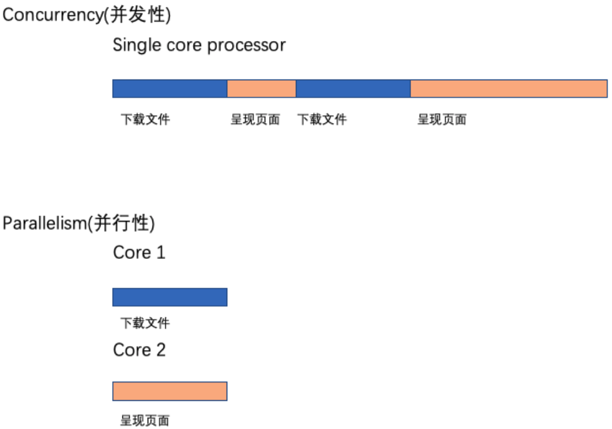
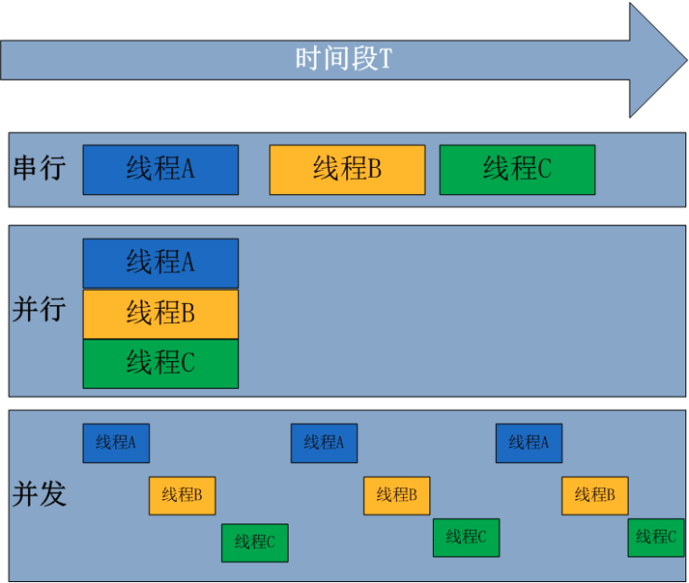
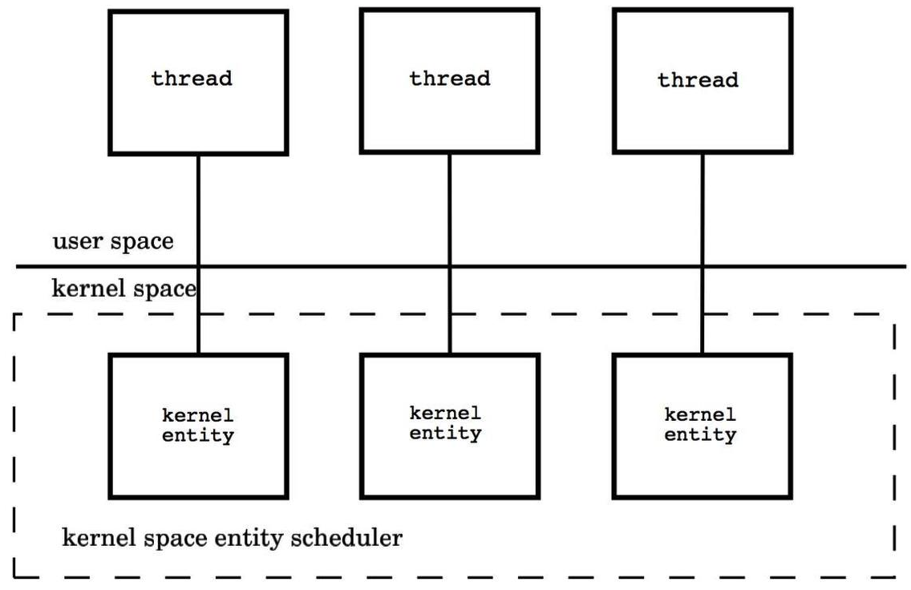
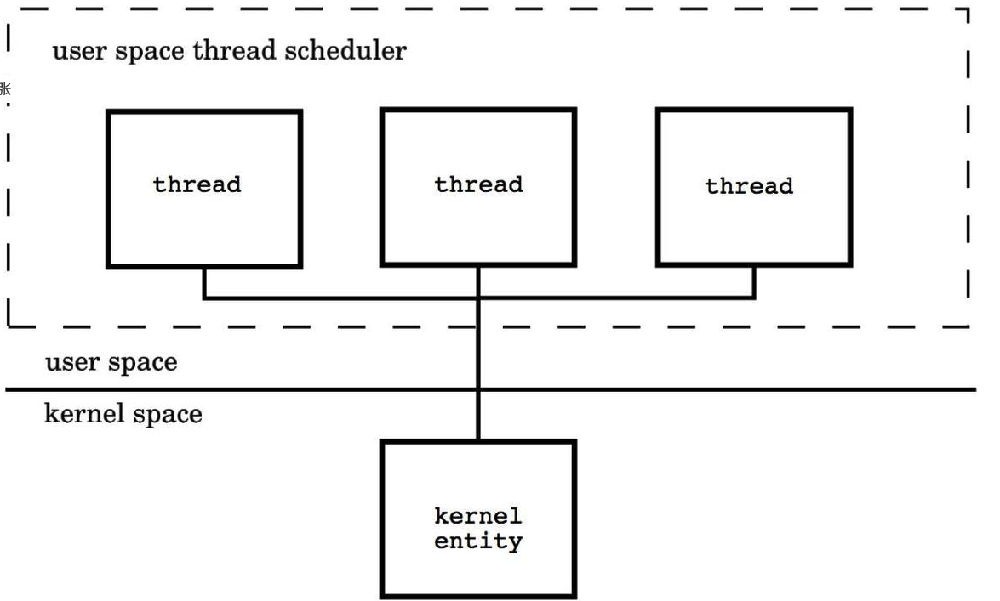

# Golang高并发模型

## 1.0 并发&并行

### 1.0.1 并发性

- 并发性(Concurrency)：是同时处理许多事情的能力。
- 并行性(parallelism)：同时在做很多事情。

并行性Parallelism不会总是导致更快的执行时间。这是因为并行运行的组件可能需要相互通信。 例如，在我们的浏览器中，当文件下载完成时，应该将其传递给用户，比如使用弹出窗口。 这种通信发生在负责下载的组件和负责呈现用户界面的组件之间。 这种通信开销在并发concurrent 系统中很低。当组件在多个内核中并行concurrent 运行时，这种通信开销很高。因此，并行程序并不总是导致更快的执行时间!

## 2.0 进程、线程、协程

### 2.1.0 进程

是一个程序在一个数据集中的一次动态执行过程，可以简单理解为“正在执行的程序”，它是CPU资源分配和调度的独立单位。

进程一般由程序、数据集、进程控制块三部分组成。

我们编写的程序用来描述进程要完成哪些功能以及如何完成；数据集则是程序在执行过程中所需要使用的资源；进程控制块用来记录进程的外部特征，描述进程的执行变化过程，系统可以利用它来控制和管理进程，它是系统感知进程存在的唯一标志。

<b>进程的局限是创建、撤销和切换的开销比较大。</b>

### 2.1.0 线程

线程是在进程之后发展出来的概念。 线程也叫轻量级进程，它是一个基本的CPU执行单元，也是程序执行过程中的最小单元，由线程ID、程序计数器、寄存器集合和堆栈共同组成。 一个进程可以包含多个线程。

线程的优点是减小了程序并发执行时的开销，提高了操作系统的并发性能，缺点是线程没有自己的系统资源，只拥有在运行时必不可少的资源，但同一进程的各线程可以共享进程所拥有的系统资源，如果把进程比作一个车间，那么线程就好比是车间里面的工人。

不过对于某些独占性资源存在锁机制，处理不当可能会产生“死锁”。

### 2.1.1 协程

<b>协程是一种用户态的轻量级线程，又称微线程，英文名Coroutine，协程的调度完全由用户控制</b>。人们通常将协程和子程序（函数）比较着理解。 子程序调用总是一个入口，一次返回，一旦退出即完成了子程序的执行。

与传统的系统级线程和进程相比，协程的最大优势在于其"轻量级"，可以轻松创建上百万个而不会导致系统资源衰竭，而线程和进程通常最多也不能超过1万的。这也是协程也叫轻量级线程的原因。

<blockquote>协程与多线程相比，其优势体现在：协程的执行效率极高。因为子程序切换不是线程切换，而是由程序自身控制，因此，没有线程切换的开销，和多线程比，线程数量越多，协程的性能优势就越明显。</blockquote>

# 二、Go语言的并发模型

Go 语言内置了 goroutine 机制，使用goroutine可以快速地开发并发程序， 更好的利用多核处理器资源。

### 2.1 线程模型

在现代操作系统中，线程是处理器调度和分配的基本单位，

- 进程则作为资源拥有的基本单位。每个进程是由私有的虚拟地址空间、代码、数据和其它各种系统资源组成。
- 线程是进程内部的一个执行单元。 每一个进程至少有一个主执行线程，它无需由用户去主动创建，是由系统自动创建的。 用户根据需要在应用程序中创建其它线程，多个线程并发地运行于同一个进程中。

我们先从线程讲起，无论语言层面何种并发模型，到了操作系统层面，一定是以线程的形态存在的。

而操作系统根据资源访问权限的不同，体系架构可分为用户空间和内核空间；

- 内核空间：主要操作访问CPU资源、I/O资源、内存资源等硬件资源，为上层应用程序提供最基本的基础资源，
- 用户空间：就是上层应用程序的固定活动空间，用户空间不可以直接访问资源，必须通过“系统调用”、“库函数”或“Shell脚本”来调用内核空间提供的资源。

我们现在的计算机语言，可以狭义的认为是一种“软件”，它们中所谓的“线程”，往往是用户态的线程，<b>和操作系统本身内核态的线程（简称KSE）</b>，还是有区别的。

Go并发编程模型在底层是由操作系统所提供的线程库支撑的，因此还是得从线程实现模型说起。

线程可以视为进程中的控制流。一个进程至少会包含一个线程，因为其中至少会有一个控制流持续运行。 因而，一个进程的第一个线程会随着这个进程的启动而创建，这个线程称为该进程的主线程。

当然，一个进程也可以包含多个线程。这些线程都是由当前进程中已存在的线程创建出来的，创建的方法就是调用系统调用，更确切地说是调用
<b>pthread create函数</b>。

拥有多个线程的进程可以并发执行多个任务，并且即使某个或某些任务被阻塞，也不会影响其他任务正常执行，这可以大大改善程序的响应时间和吞吐量。

另一方面，线程不可能独立于进程存在。它的生命周期不可能逾越其所属进程的生命周期。

<b>线程的实现模型主要有3个，分别是:用户级线程模型、内核级线程模型和两级线程模型。</b>

它们之间最大的差异就在于线程与<b>内核调度实体( Kernel Scheduling Entity,简称KSE)</b>之间的对应关系上。

顾名思义，内核调度实体就是可以被内核的调度器调度的对象。在很多文献和书中，它也称为内核级线程，是操作系统内核的最小调度单元。

### 2.1.1 内核级线程模型

用户线程与KSE是1对1关系(1:1)。

大部分编程语言的线程库(如linux的pthread，Java的java.lang.Thread，C++11的std::thread等等)都是对操作系统的线程（内核级线程）的一层封装，创建出来的每个线程与一个不同的KSE静态关联，因此其调度完全由OS调度器来做。

这种方式实现简单，直接借助OS提供的线程能力，并且不同用户线程之间一般也不会相互影响。

但其创建，销毁以及多个线程之间的上下文切换等操作都是直接由OS层面亲自来做，在需要使用大量线程的场景下对OS的性能影响会很大。

每个线程由<b>内核调度器</b>独立的调度，所以如果一个线程阻塞则不影响其他的线程。

- 优点：在多核处理器的硬件的支持下，内核空间线程模型支持了真正的并行，当一个线程被阻塞后，允许另一个线程继续执行，所以并发能力较强。
- 缺点：每创建一个用户级线程都需要创建一个内核级线程与其对应，这样创建线程的开销比较大，会影响到应用程序的性能。

### 2.1.2 用户级线程模型

用户线程与KSE是多对1关系(M:1)，这种线程的创建，销毁以及多个线程之间的协调等操作都是由用户自己实现的线程库来负责，对OS内核透明，一个进程中所有创建的线程都与同一个KSE在运行时动态关联。

现在有许多语言实现的 协程 基本上都属于这种方式。这种实现方式相比内核级线程可以做的很轻量级，对系统资源的消耗会小很多，因此可以创建的数量与上下文切换所花费的代价也会小得多。

但该模型有个致命的缺点，如果我们在某个用户线程上调用阻塞式系统调用(如用阻塞方式read网络IO)，那么一旦KSE因阻塞被内核调度出CPU的话，剩下的所有对应的用户线程全都会变为阻塞状态（整个进程挂起）。

所以这些语言的协程库会把自己一些阻塞的操作重新封装为完全的非阻塞形式，然后在以前要阻塞的点上，主动让出自己，并通过某种方式通知或唤醒其他待执行的用户线程在该KSE上运行，从而避免了内核调度器由于KSE阻塞而做上下文切换，这样整个进程也不会被阻塞了。

优点：这种模型的好处是线程上下文切换都发生在用户空间，避免的模态切换（mode switch），从而对于性能有积极的影响。

缺点：所有的线程基于一个内核调度实体即内核线程，这意味着只有一个处理器可以被利用，在多处理器环境下这是不能够被接受的，本质上，用户线程只解决了并发问题，但是没有解决并行问题。如果线程因为 I/O 操作陷入了内核态，内核态线程阻塞等待 I/O 数据，则所有的线程都将会被阻塞，用户空间也可以使用非阻塞而 I/O，但是不能避免性能及复杂度问题。

### 2.1.3 两级线程模型

用户线程与KSE是多对多关系(M:N)，这种实现综合了前两种模型的优点，为一个进程中创建多个KSE，并且线程可以与不同的KSE在运行时进行动态关联，当某个KSE由于其上工作的线程的阻塞操作被内核调度出CPU时，当前与其关联的其余用户线程可以重新与其他KSE建立关联关系。

当然这种动态关联机制的实现很复杂，也需要用户自己去实现，这算是它的一个缺点。

Go语言中的并发就是使用的这种实现方式，Go为了实现该模型自己实现了一个运行时调度器来负责Go中的"线程"与KSE的动态关联。

此模型有时也被称为 混合型线程模型，即用户调度器实现用户线程到KSE的“调度”，内核调度器实现KSE到CPU上的调度。

